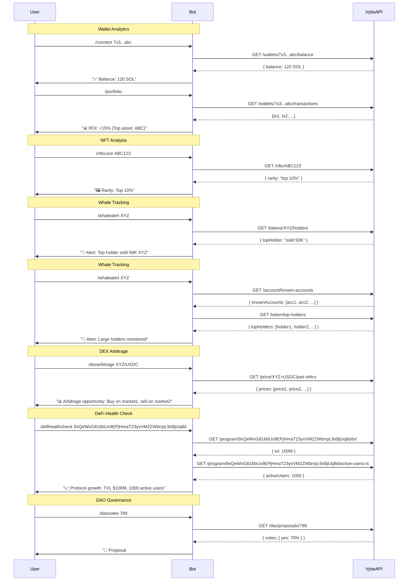

```mermaid
sequenceDiagram
    participant User
    participant Bot
    participant VybeAPI

    Note over User,Bot: Wallet Analytics
    User->>Bot: /connect 7x3...abc
    Bot->>VybeAPI: GET /wallets/7x3...abc/balance
    VybeAPI-->>Bot: { balance: 120 SOL }
    Bot->>User: "✅ Balance: 120 SOL"

    User->>Bot: /portfolio
    Bot->>VybeAPI: GET /wallets/7x3...abc/transactions
    VybeAPI-->>Bot: [tx1, tx2, ...]
    Bot->>User: "📊 ROI: +15% (Top asset: ABC)"

    Note over User,Bot: NFT Analysis
    User->>Bot: /nftscore ABC123
    Bot->>VybeAPI: GET /nfts/ABC123
    VybeAPI-->>Bot: { rarity: "top 10%" }
    Bot->>User: "🖼️ Rarity: Top 10%"

    Note over User,Bot: Whale Tracking
    User->>Bot: /whalealert XYZ
    Bot->>VybeAPI: GET /tokens/XYZ/holders
    VybeAPI-->>Bot: { topHolder: "sold 50K" }
    Bot->>User: "🐋 Alert: Top holder sold 50K XYZ"

    Note over User,Bot: Whale Tracking
    User->>Bot: /whalealert XYZ
    Bot->>VybeAPI: GET /account/known-accounts
    VybeAPI-->>Bot: { knownAccounts: [acc1, acc2, ...] }
    Bot->>VybeAPI: GET /token/top-holders
    VybeAPI-->>Bot: { topHolders: [holder1, holder2, ...] }
    Bot->>User: "🐋 Alert: Large holders monitored"

    Note over User,Bot: DEX Arbitrage
    User->>Bot: /dexarbitrage XYZ/USDC
    Bot->>VybeAPI: GET /price/XYZ+USDC/pair-ohlcv
    VybeAPI-->>Bot: { prices: [price1, price2, ...] }
    Bot->>User: "📊 Arbitrage opportunity: Buy on market1, sell on market2"

    Note over User,Bot: DeFi Health Check
    User->>Bot: /defihealthcheck 9xQeWvG816bUx9EPjHmaT23yvVM2ZWbrrpL9xBjUq8d
    Bot->>VybeAPI: GET /program/9xQeWvG816bUx9EPjHmaT23yvVM2ZWbrrpL9xBjUq8d/tvl
    VybeAPI-->>Bot: { tvl: 100M }
    Bot->>VybeAPI: GET /program/9xQeWvG816bUx9EPjHmaT23yvVM2ZWbrrpL9xBjUq8d/active-users-ts
    VybeAPI-->>Bot: { activeUsers: 1000 }
    Bot->>User: "📈 Protocol growth: TVL $100M, 1000 active users"

    Note over User,Bot: DAO Governance
    User->>Bot: /daovotes 789
    Bot->>VybeAPI: GET /dao/proposals/789
    VybeAPI-->>Bot: { votes: { yes: 70% } }
    Bot->>User: "📜 Proposal #789: 70% Yes"
```
