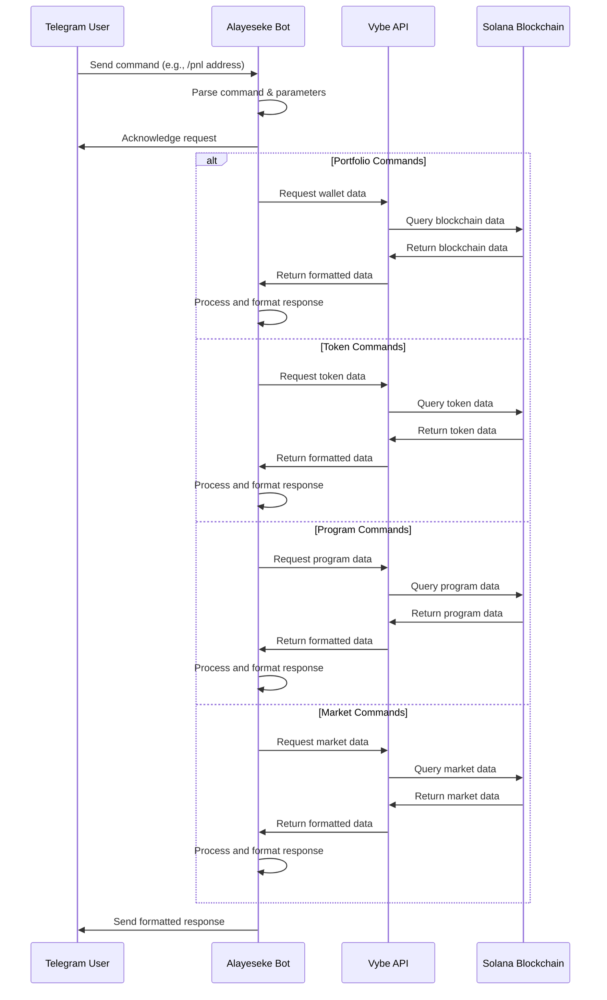

# Alayeseke Bot

A powerful Telegram bot that provides Solana blockchain data analysis through the Vybe API.

## Features

Alayeseke Bot offers a comprehensive set of commands to analyze Solana blockchain data:

### Portfolio Commands
- `/pnl` - Check wallet profit and loss
- `/report` - Get detailed wallet report
- `/nfts` - View NFT portfolio
- `/token_history` - View token balance history

### Token Commands
- `/top_holders` - View top holders of a token
- `/price` - Check token price with OHLC data
- `/transfers` - View recent token transfers
- `/trades` - View recent token trades

### Program & Market Commands
- `/program` - Get program details
- `/program_activity` - Check program activity
- `/market` - Check market OHLC data
- `/pair` - Check trading pair data

### Other Commands
- `/holder_portfolio` - Examine a specific holder's portfolio
- `/help` - Show this help message

## How It Works

The Alayeseke bot is a Telegram bot that shows Solana blockchain data. It uses the Vybe API to get this data and show it to users.

Users talk to the bot by sending commands with a slash ("/"). Here are the main things the bot can do:

* **/start**: Welcomes users and tells them about the bot
* **/help**: Shows all commands the bot can do
* **/top_holders**: Shows who owns the most of a token
* **/program**: Shows info about Solana programs (apps)
* **/market**: Shows price charts for trading pairs on markets
* **/pair**: Shows trading info across different exchanges

When a user sends a command, the bot:
1. Checks what the user asked for
2. Sends a request to the Vybe API
3. Gets data back from the API
4. Formats the data to look nice
5. Sends the formatted info back to the user

The bot handles errors if the API doesn't work or if users type commands wrong. It also formats big numbers to be easy to read, like showing "$5.2M" instead of "$5,200,000".

This makes it easy for users to get Solana blockchain data right in Telegram without going to other websites.

## Architecture

The bot is built using TypeScript and leverages the Vybe API to fetch Solana blockchain data. It uses the GrammY framework for Telegram bot functionality.



## Technical Implementation

The bot is implemented with the following components:

1. **Command Handlers**: Each command has a dedicated handler function that processes user input and calls the appropriate API methods.

2. **API Integration**: The bot uses a typed wrapper around the Vybe API to handle API requests with proper error handling and retries.

3. **Response Formatting**: Responses are formatted in Markdown for better readability with emojis and structured data.

4. **Error Handling**: Comprehensive error handling ensures the bot remains responsive even when API calls fail.

5. **Retry Mechanism**: A retry mechanism is implemented to handle temporary API failures.

## Setup

1. Clone the repository
2. Install dependencies:
   ```
   npm install
   ```
3. Create a `.env` file with the following variables:
   ```
   TELEGRAM_TOKEN=your_telegram_token
   VYBE_API_KEY=your_vybe_api_key
   ```
4. Start the bot:
   ```
   npm start
   ```

## Development

The project is written in TypeScript and uses the following technologies:

- [GrammY](https://grammy.dev/) - Telegram Bot Framework
- [Vybe API](https://docs.vybe.xyz/) - Solana Data API
- [TypeScript](https://www.typescriptlang.org/) - Programming Language
- [dotenv](https://www.npmjs.com/package/dotenv) - Environment Variable Management

## License

This project is licensed under the MIT License - see the [LICENSE](LICENSE) file for details.
